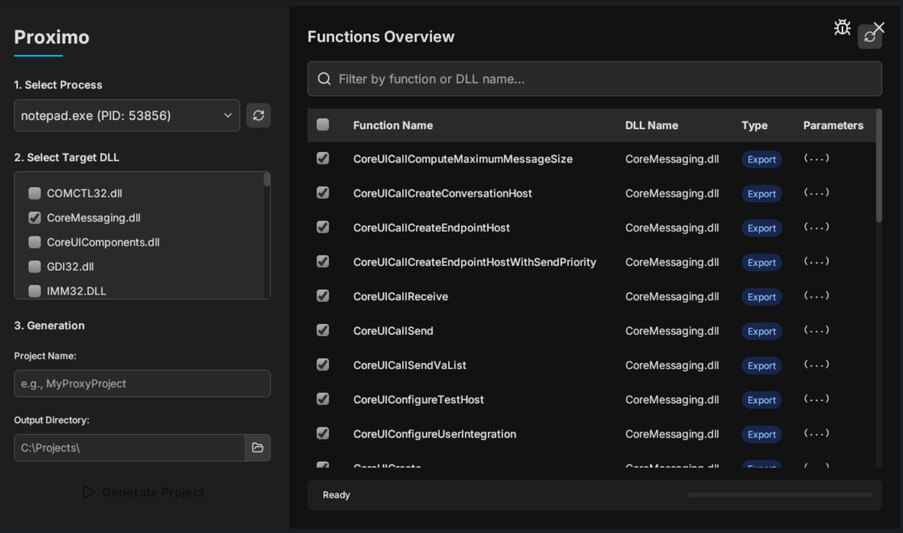

# Proximo

A modern, GUI-based tool for easily generating C++ proxy DLL projects. Built with C++, ImGui, Ultralight, and LIEF.



## About The Project

Proxying a DLL is a powerful technique used in software development, reverse engineering, and game modding. It involves creating a fake DLL that has the same name and exports all the same functions as a real DLL. When an application tries to load the real DLL, it loads our proxy instead. The proxy then loads the real DLL and forwards all the function calls, acting as a "man-in-the-middle". This allows you to intercept, inspect, and even modify the function calls.

However, creating a proxy DLL manually is a tedious process that involves analyzing the target DLL, finding all its exports, and writing a lot of boilerplate code. **Proximo automates this entire process**, allowing you to generate a complete, ready-to-compile project with just a few clicks.

## Key Features

* **Process Inspector:** Lists all running processes on your system.
* **DLL Analysis:** Scans a selected process and lists all loaded DLLs. System-critical DLLs are highlighted in red and disabled to prevent misuse.
* **Export Viewer:** Uses the powerful LIEF library to parse a DLL and display all of its exported functions.
* **Selective Proxying:** Choose exactly which functions you want to include in your proxy.
* **Full Project Generation:** Creates a complete C++ project with:
    * A `CMakeLists.txt` for easy building.
    * A `.def` file to ensure all exports match the original.
    * A `proxy.asm` file for function forwarding.
* **Modern UI:** A clean and responsive user interface built on HTML/CSS/JS (via Ultralight).

## How To Use Proximo

1.  Launch `Proximo.exe`.
2.  Select a target application from the **"Select Process"** dropdown list.
3.  Proximo will load all DLLs used by that process.
4.  The functions exported by that DLL will appear in the **"Functions Overview"** table on the right. By default, all are selected. You can uncheck any functions you don't want to proxy.
5.  Enter a **Project Name** and select an **Output Directory** for your new project files.
6.  Click the **"Generate Project"** button.

## Using The Generated Project

Proximo has now created a folder containing a full C++ project. To use it:

1.  **Find the original DLL** that your target application uses (e.g., `dinput8.dll`). This might be in the application's folder or in a system folder like `C:\Windows\System32`.
2.  **Copy the original DLL** into your application's main directory.
3.  **Rename the original DLL**. A common convention is to add `_original`. For example, `dinput8.dll` becomes `dinput8_original.dll`. The generated code expects this name.
4.  **Build your generated project** using CMake and a C++ compiler like Visual Studio. This will create your proxy DLL (e.g., `MyProxyProject.dll`).
5.  **Rename your proxy DLL** to match the original DLL's name exactly (e.g., rename `MyProxyProject.dll` to `dinput8.dll`).
6.  **Copy your renamed proxy DLL** into the application's main directory.

Your application's folder should now contain the `.exe`, your proxy (`dinput8.dll`), and the renamed original (`dinput8_original.dll`). When you run the application, it will load your proxy, and you will see a message box confirming it worked!

## Building Proximo From Source

To build Proximo itself, you will need the following dependencies:

* **CMake** (3.15 or higher)
* **C++17 Compiler** (e.g., Visual Studio 2019 or newer)
* **ImGui** (Docking Branch)
* **Ultralight SDK**
* **LIEF SDK**
* **nlohmann/json** (single `json.hpp` file)

**Build Steps:**
1.  Clone this repository.
2.  Download the dependencies.
3.  Update the paths to ImGui, Ultralight, and LIEF at the top of the `CMakeLists.txt` file.
4.  Use CMake to generate the build files for your chosen compiler (e.g., Visual Studio).
    ```bash
    # Create a build directory
    cmake -B build
    
    # Build the project
    cmake --build build --config Release
    ```
5.  The final executable will be in the `build/Release` directory.

## License

This project is licensed under the GNU v3 License. See the `LICENSE` file for details.

## Acknowledgements
* [ImGui](https://github.com/ocornut/imgui)
* [Ultralight](https://ultralig.ht/)
* [LIEF](https://lief-project.github.io/)
* [nlohmann/json](https://github.com/nlohmann/json)
